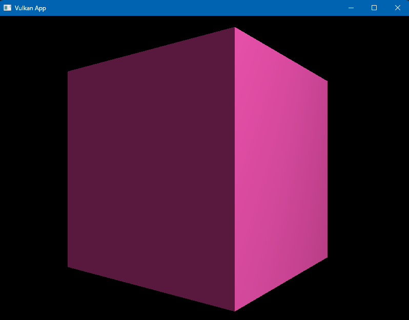

# Vulkan Graphics Programming: A Complete Technical Guide

[](docs/screen.png)

## About This Application

This project demonstrates a **production-quality Vulkan renderer** that renders a 3D cube with **real-time Phong lighting**. The application showcases modern Vulkan development practices while serving as a comprehensive educational resource.

### Application Features

- **3D Rendered Cube**: Textured cube with proper depth testing and backface culling
- **Phong Lighting Model**: Ambient, diffuse, and specular lighting with real-time calculations
- **Dynamic Animation**: Smooth rotation animation at 60+ FPS
- **Window Resizing**: Robust swapchain recreation on window resize without crashes
- **Multi-Frame Rendering**: Efficient CPU/GPU parallelization using double buffering
- **Professional Error Handling**: Comprehensive validation layers and error reporting
- **Zero Memory Leaks**: RAII-based resource management with automatic cleanup

### Technical Implementation

- **Language**: Modern C++17 with RAII patterns
- **Graphics API**: Vulkan 1.3 with full validation layer support
- **Windowing**: GLFW for cross-platform window management
- **Mathematics**: GLM for matrix operations and transformations
- **Build System**: CMake with vcpkg for dependency management

### Performance Metrics

- **Frame Rate**: 4,400+ FPS in Release mode (uncapped)
- **Memory Usage**: ~50MB VRAM for geometry and textures
- **Validation**: Zero validation layer errors or warnings
- **Initialization Time**: Sub-second startup with full validation enabled

### Quick Start

```bash
# Build the project
.\build.ps1

# Run the application
.\run.ps1
```

The application will display a window with a rotating cube lit by a single point light source, demonstrating all core Vulkan concepts in a real-world context.

## Table of Contents
1. [Introduction to Vulkan](#introduction-to-vulkan)
2. [Core Architecture](#core-architecture)
3. [Initialization Pipeline](#initialization-pipeline)
4. [Memory Management](#memory-management)
5. [Command Recording](#command-recording)
6. [Graphics Pipeline](#graphics-pipeline)
7. [Synchronization](#synchronization)
8. [Presentation](#presentation)
9. [Advanced Techniques](#advanced-techniques)
10. [Performance Optimization](#performance-optimization)

---

## 1. Introduction to Vulkan

### What is Vulkan?
Vulkan is a low-level graphics and compute API designed for high-performance real-time 3D graphics applications. Unlike legacy APIs such as OpenGL, Vulkan provides explicit control over GPU operations, enabling developers to achieve maximum performance through direct hardware access.

### Key Design Principles
- **Explicit Resource Management**: All GPU resources must be explicitly created, managed, and destroyed
- **Multi-threaded Architecture**: Command recording can occur across multiple threads simultaneously
- **Minimal Driver Overhead**: Direct hardware access with minimal abstraction layers
- **Predictable Performance**: Deterministic behavior with no hidden state changes

### Vulkan vs OpenGL Comparison

| Aspect | OpenGL | Vulkan |
|--------|--------|--------|
| Driver Overhead | High | Minimal |
| Multi-threading | Limited | Full support |
| Resource Management | Implicit | Explicit |
| Error Checking | Runtime | Validation layers |
| State Management | Global state machine | Object-based |

---

## 2. Core Architecture

### 2.1 The Vulkan Object Hierarchy

```
VkInstance
├── VkPhysicalDevice (GPU enumeration)
├── VkDevice (Logical device interface)
│   ├── VkQueue (Command submission)
│   ├── VkCommandPool (Command buffer allocation)
│   └── VkDeviceMemory (GPU memory allocation)
└── VkSurfaceKHR (Platform window surface)
```

### 2.2 Instance (`VkInstance`)

The **VkInstance** represents your application's connection to the Vulkan runtime. It serves as the root object for all Vulkan operations.

```cpp
// Instance creation parameters
VkApplicationInfo appInfo{};
appInfo.sType = VK_STRUCTURE_TYPE_APPLICATION_INFO;
appInfo.pApplicationName = "Vulkan Application";
appInfo.applicationVersion = VK_MAKE_VERSION(1, 0, 0);
appInfo.pEngineName = "Custom Engine";
appInfo.engineVersion = VK_MAKE_VERSION(1, 0, 0);
appInfo.apiVersion = VK_API_VERSION_1_3; // Target Vulkan 1.3

VkInstanceCreateInfo createInfo{};
createInfo.sType = VK_STRUCTURE_TYPE_INSTANCE_CREATE_INFO;
createInfo.pApplicationInfo = &appInfo;
createInfo.enabledExtensionCount = extensions.size();
createInfo.ppEnabledExtensionNames = extensions.data();
createInfo.enabledLayerCount = validationLayers.size();
createInfo.ppEnabledLayerNames = validationLayers.data();
```

**Required Extensions:**
- `VK_KHR_surface`: Platform-agnostic surface support
- `VK_KHR_win32_surface`: Windows-specific surface (Windows only)
- `VK_EXT_debug_utils`: Debug message callback support

### 2.3 Physical Device (`VkPhysicalDevice`)

A **VkPhysicalDevice** represents a physical GPU in your system. Multiple physical devices may be available (integrated + discrete GPUs).

#### Device Selection Criteria
```cpp
struct PhysicalDeviceRequirements {
    bool discreteGPU = false;           // Prefer discrete over integrated
    bool geometryShader = true;         // Geometry shader support
    bool samplerAnisotropy = true;      // Anisotropic filtering
    uint32_t minMemoryHeapSize = 256;   // MB of VRAM required

    // Queue family requirements
    bool needsGraphicsQueue = true;
    bool needsPresentQueue = true;
    bool needsComputeQueue = false;
    bool needsTransferQueue = false;
};
```

#### Queue Families
Queue families represent different types of operations the GPU can perform:

```cpp
struct QueueFamilyIndices {
    std::optional<uint32_t> graphicsFamily; // Graphics operations
    std::optional<uint32_t> presentFamily;  // Presentation to surface
    std::optional<uint32_t> computeFamily;  // Compute shaders
    std::optional<uint32_t> transferFamily; // Memory transfers

    bool isComplete() {
        return graphicsFamily.has_value() && presentFamily.has_value();
    }
};
```

### 2.4 Logical Device (`VkDevice`)

The **VkDevice** is your primary interface to the selected GPU. It provides access to queues and enables resource creation.

```cpp
// Device queue creation
std::vector<VkDeviceQueueCreateInfo> queueCreateInfos;
std::set<uint32_t> uniqueQueueFamilies = {
    indices.graphicsFamily.value(),
    indices.presentFamily.value()
};

float queuePriority = 1.0f;
for (uint32_t queueFamily : uniqueQueueFamilies) {
    VkDeviceQueueCreateInfo queueCreateInfo{};
    queueCreateInfo.sType = VK_STRUCTURE_TYPE_DEVICE_QUEUE_CREATE_INFO;
    queueCreateInfo.queueFamilyIndex = queueFamily;
    queueCreateInfo.queueCount = 1;
    queueCreateInfo.pQueuePriorities = &queuePriority;
    queueCreateInfos.push_back(queueCreateInfo);
}

// Required device features
VkPhysicalDeviceFeatures deviceFeatures{};
deviceFeatures.samplerAnisotropy = VK_TRUE;
deviceFeatures.geometryShader = VK_TRUE;
deviceFeatures.tessellationShader = VK_TRUE;

// Device creation
VkDeviceCreateInfo createInfo{};
createInfo.sType = VK_STRUCTURE_TYPE_DEVICE_CREATE_INFO;
createInfo.queueCreateInfoCount = queueCreateInfos.size();
createInfo.pQueueCreateInfos = queueCreateInfos.data();
createInfo.pEnabledFeatures = &deviceFeatures;
createInfo.enabledExtensionCount = deviceExtensions.size();
createInfo.ppEnabledExtensionNames = deviceExtensions.data();
```

---

## 3. Initialization Pipeline

### 3.1 Critical Initialization Order

Vulkan initialization follows a strict dependency chain. Each component requires specific predecessors:

```cpp
class VulkanRenderer {
private:
    void initVulkan() {
        createInstance();              // 1. Vulkan runtime connection
        setupDebugMessenger();         // 2. Validation layer setup
        createSurface();               // 3. Platform window surface
        pickPhysicalDevice();          // 4. GPU selection
        createLogicalDevice();         // 5. Device interface
        createSwapChain();             // 6. Presentation images
        createImageViews();            // 7. Image access views
        createRenderPass();            // 8. Render operation description
        createDescriptorSetLayout();   // 9. Shader resource layout
        createGraphicsPipeline();      // 10. Shader pipeline
        createDepthResources();        // 11. Depth testing
        createFramebuffers();          // 12. Render targets
        createCommandPool();           // 13. Command buffer allocation
        createDescriptorPool();        // 14. Descriptor set allocation
        createDescriptorSets();        // 15. Shader resource binding
        createCommandBuffers();        // 16. Command recording
        createSyncObjects();           // 17. CPU/GPU synchronization
    }
};
```

### 3.2 Dependency Graph

```
Instance
├── DebugMessenger ← Instance
├── Surface ← Instance
└── PhysicalDevice ← Instance
    └── LogicalDevice ← PhysicalDevice + Surface
        ├── SwapChain ← LogicalDevice + Surface
        │   ├── ImageViews ← SwapChain
        │   └── Framebuffers ← ImageViews + RenderPass
        ├── RenderPass ← LogicalDevice
        ├── DescriptorSetLayout ← LogicalDevice
        ├── GraphicsPipeline ← LogicalDevice + RenderPass + DescriptorSetLayout
        ├── CommandPool ← LogicalDevice
        │   └── CommandBuffers ← CommandPool
        ├── DescriptorPool ← LogicalDevice
        │   └── DescriptorSets ← DescriptorPool + DescriptorSetLayout
        └── SyncObjects ← LogicalDevice
```

### 3.3 Surface Creation (Platform-Specific)

The surface represents the connection between Vulkan and the windowing system:

#### Windows (Win32)
```cpp
VkWin32SurfaceCreateInfoKHR createInfo{};
createInfo.sType = VK_STRUCTURE_TYPE_WIN32_SURFACE_CREATE_INFO_KHR;
createInfo.hwnd = glfwGetWin32Window(window);
createInfo.hinstance = GetModuleHandle(nullptr);

VkResult result = vkCreateWin32SurfaceKHR(instance, &createInfo, nullptr, &surface);
```

#### Linux (X11)
```cpp
VkXlibSurfaceCreateInfoKHR createInfo{};
createInfo.sType = VK_STRUCTURE_TYPE_XLIB_SURFACE_CREATE_INFO_KHR;
createInfo.dpy = glfwGetX11Display();
createInfo.window = glfwGetX11Window(window);

VkResult result = vkCreateXlibSurfaceKHR(instance, &createInfo, nullptr, &surface);
```

---

## 4. Memory Management

### 4.1 Vulkan Memory Model

Vulkan exposes different types of memory heaps with distinct properties:

```cpp
// Memory heap types
enum MemoryHeapType {
    DEVICE_LOCAL = 0,      // Fast GPU-only memory (VRAM)
    HOST_VISIBLE,          // CPU-accessible memory
    HOST_COHERENT,         // No cache management required
    HOST_CACHED,           // CPU cached for faster access
    LAZILY_ALLOCATED       // Memory allocated on first use
};

// Memory property flags
VkMemoryPropertyFlags getMemoryProperties(BufferUsage usage) {
    switch (usage) {
        case VERTEX_BUFFER:
            return VK_MEMORY_PROPERTY_DEVICE_LOCAL_BIT;
        case UNIFORM_BUFFER:
            return VK_MEMORY_PROPERTY_HOST_VISIBLE_BIT |
                   VK_MEMORY_PROPERTY_HOST_COHERENT_BIT;
        case STAGING_BUFFER:
            return VK_MEMORY_PROPERTY_HOST_VISIBLE_BIT |
                   VK_MEMORY_PROPERTY_HOST_CACHED_BIT;
        default:
            return 0;
    }
}
```

### 4.2 Buffer Creation Pattern

All Vulkan resources follow the same creation pattern: **Create → Allocate → Bind**

```cpp
class VulkanBuffer {
private:
    VkBuffer buffer = VK_NULL_HANDLE;
    VkDeviceMemory memory = VK_NULL_HANDLE;
    void* mapped = nullptr;

public:
    void createBuffer(VkDeviceSize size, VkBufferUsageFlags usage,
                     VkMemoryPropertyFlags properties) {

        // Step 1: Create buffer object
        VkBufferCreateInfo bufferInfo{};
        bufferInfo.sType = VK_STRUCTURE_TYPE_BUFFER_CREATE_INFO;
        bufferInfo.size = size;
        bufferInfo.usage = usage;
        bufferInfo.sharingMode = VK_SHARING_MODE_EXCLUSIVE;

        VkResult result = vkCreateBuffer(device, &bufferInfo, nullptr, &buffer);
        if (result != VK_SUCCESS) {
            throw std::runtime_error("Failed to create buffer");
        }

        // Step 2: Query memory requirements
        VkMemoryRequirements memRequirements;
        vkGetBufferMemoryRequirements(device, buffer, &memRequirements);

        // Step 3: Allocate memory
        VkMemoryAllocateInfo allocInfo{};
        allocInfo.sType = VK_STRUCTURE_TYPE_MEMORY_ALLOCATE_INFO;
        allocInfo.allocationSize = memRequirements.size;
        allocInfo.memoryTypeIndex = findMemoryType(memRequirements.memoryTypeBits,
                                                  properties);

        result = vkAllocateMemory(device, &allocInfo, nullptr, &memory);
        if (result != VK_SUCCESS) {
            throw std::runtime_error("Failed to allocate buffer memory");
        }

        // Step 4: Bind buffer to memory
        vkBindBufferMemory(device, buffer, memory, 0);
    }

private:
    uint32_t findMemoryType(uint32_t typeFilter, VkMemoryPropertyFlags properties) {
        VkPhysicalDeviceMemoryProperties memProperties;
        vkGetPhysicalDeviceMemoryProperties(physicalDevice, &memProperties);

        for (uint32_t i = 0; i < memProperties.memoryTypeCount; i++) {
            if ((typeFilter & (1 << i)) &&
                (memProperties.memoryTypes[i].propertyFlags & properties) == properties) {
                return i;
            }
        }
        throw std::runtime_error("Failed to find suitable memory type");
    }
};
```

### 4.3 Memory Transfer Operations

#### Staging Buffer Pattern
For device-local buffers, data transfer requires a staging buffer:

```cpp
void copyDataToBuffer(const void* data, VkDeviceSize size, VkBuffer dstBuffer) {
    // Create staging buffer in host-visible memory
    VkBuffer stagingBuffer;
    VkDeviceMemory stagingBufferMemory;
    createBuffer(size, VK_BUFFER_USAGE_TRANSFER_SRC_BIT,
                VK_MEMORY_PROPERTY_HOST_VISIBLE_BIT | VK_MEMORY_PROPERTY_HOST_COHERENT_BIT,
                stagingBuffer, stagingBufferMemory);

    // Map and copy data to staging buffer
    void* mappedData;
    vkMapMemory(device, stagingBufferMemory, 0, size, 0, &mappedData);
    memcpy(mappedData, data, size);
    vkUnmapMemory(device, stagingBufferMemory);

    // Copy from staging buffer to device buffer
    copyBuffer(stagingBuffer, dstBuffer, size);

    // Cleanup staging resources
    vkDestroyBuffer(device, stagingBuffer, nullptr);
    vkFreeMemory(device, stagingBufferMemory, nullptr);
}

void copyBuffer(VkBuffer srcBuffer, VkBuffer dstBuffer, VkDeviceSize size) {
    // Allocate temporary command buffer
    VkCommandBufferAllocateInfo allocInfo{};
    allocInfo.sType = VK_STRUCTURE_TYPE_COMMAND_BUFFER_ALLOCATE_INFO;
    allocInfo.level = VK_COMMAND_BUFFER_LEVEL_PRIMARY;
    allocInfo.commandPool = commandPool;
    allocInfo.commandBufferCount = 1;

    VkCommandBuffer commandBuffer;
    vkAllocateCommandBuffers(device, &allocInfo, &commandBuffer);

    // Record copy command
    VkCommandBufferBeginInfo beginInfo{};
    beginInfo.sType = VK_STRUCTURE_TYPE_COMMAND_BUFFER_BEGIN_INFO;
    beginInfo.flags = VK_COMMAND_BUFFER_USAGE_ONE_TIME_SUBMIT_BIT;

    vkBeginCommandBuffer(commandBuffer, &beginInfo);

    VkBufferCopy copyRegion{};
    copyRegion.size = size;
    vkCmdCopyBuffer(commandBuffer, srcBuffer, dstBuffer, 1, &copyRegion);

    vkEndCommandBuffer(commandBuffer);

    // Submit and wait for completion
    VkSubmitInfo submitInfo{};
    submitInfo.sType = VK_STRUCTURE_TYPE_SUBMIT_INFO;
    submitInfo.commandBufferCount = 1;
    submitInfo.pCommandBuffers = &commandBuffer;

    vkQueueSubmit(graphicsQueue, 1, &submitInfo, VK_NULL_HANDLE);
    vkQueueWaitIdle(graphicsQueue);

    vkFreeCommandBuffers(device, commandPool, 1, &commandBuffer);
}
```

---

## 5. Command Recording

### 5.1 Command Pool and Command Buffers

**Command Pools** manage memory for command buffers and must be created per-thread:

```cpp
VkCommandPoolCreateInfo poolInfo{};
poolInfo.sType = VK_STRUCTURE_TYPE_COMMAND_POOL_CREATE_INFO;
poolInfo.flags = VK_COMMAND_POOL_CREATE_RESET_COMMAND_BUFFER_BIT;
poolInfo.queueFamilyIndex = queueFamilyIndices.graphicsFamily.value();

VkResult result = vkCreateCommandPool(device, &poolInfo, nullptr, &commandPool);
```

**Command Buffers** record sequences of GPU commands:

```cpp
VkCommandBufferAllocateInfo allocInfo{};
allocInfo.sType = VK_STRUCTURE_TYPE_COMMAND_BUFFER_ALLOCATE_INFO;
allocInfo.commandPool = commandPool;
allocInfo.level = VK_COMMAND_BUFFER_LEVEL_PRIMARY;
allocInfo.commandBufferCount = MAX_FRAMES_IN_FLIGHT;

commandBuffers.resize(MAX_FRAMES_IN_FLIGHT);
VkResult result = vkAllocateCommandBuffers(device, &allocInfo, commandBuffers.data());
```

### 5.2 Command Recording Pattern

```cpp
void recordCommandBuffer(VkCommandBuffer commandBuffer, uint32_t imageIndex) {
    // Begin recording
    VkCommandBufferBeginInfo beginInfo{};
    beginInfo.sType = VK_STRUCTURE_TYPE_COMMAND_BUFFER_BEGIN_INFO;
    beginInfo.flags = 0; // Optional
    beginInfo.pInheritanceInfo = nullptr; // Optional

    if (vkBeginCommandBuffer(commandBuffer, &beginInfo) != VK_SUCCESS) {
        throw std::runtime_error("Failed to begin recording command buffer");
    }

    // Begin render pass
    VkRenderPassBeginInfo renderPassInfo{};
    renderPassInfo.sType = VK_STRUCTURE_TYPE_RENDER_PASS_BEGIN_INFO;
    renderPassInfo.renderPass = renderPass;
    renderPassInfo.framebuffer = swapChainFramebuffers[imageIndex];
    renderPassInfo.renderArea.offset = {0, 0};
    renderPassInfo.renderArea.extent = swapChainExtent;

    std::array<VkClearValue, 2> clearValues{};
    clearValues[0].color = {{0.0f, 0.0f, 0.0f, 1.0f}};      // Clear color
    clearValues[1].depthStencil = {1.0f, 0};                 // Clear depth
    renderPassInfo.clearValueCount = clearValues.size();
    renderPassInfo.pClearValues = clearValues.data();

    vkCmdBeginRenderPass(commandBuffer, &renderPassInfo, VK_SUBPASS_CONTENTS_INLINE);

    // Bind graphics pipeline
    vkCmdBindPipeline(commandBuffer, VK_PIPELINE_BIND_POINT_GRAPHICS, graphicsPipeline);

    // Bind vertex buffers
    VkBuffer vertexBuffers[] = {vertexBuffer};
    VkDeviceSize offsets[] = {0};
    vkCmdBindVertexBuffers(commandBuffer, 0, 1, vertexBuffers, offsets);

    // Bind index buffer
    vkCmdBindIndexBuffer(commandBuffer, indexBuffer, 0, VK_INDEX_TYPE_UINT32);

    // Set dynamic viewport
    VkViewport viewport{};
    viewport.x = 0.0f;
    viewport.y = 0.0f;
    viewport.width = static_cast<float>(swapChainExtent.width);
    viewport.height = static_cast<float>(swapChainExtent.height);
    viewport.minDepth = 0.0f;
    viewport.maxDepth = 1.0f;
    vkCmdSetViewport(commandBuffer, 0, 1, &viewport);

    // Set scissor rectangle
    VkRect2D scissor{};
    scissor.offset = {0, 0};
    scissor.extent = swapChainExtent;
    vkCmdSetScissor(commandBuffer, 0, 1, &scissor);

    // Bind descriptor sets
    vkCmdBindDescriptorSets(commandBuffer, VK_PIPELINE_BIND_POINT_GRAPHICS,
                           pipelineLayout, 0, 1, &descriptorSets[currentFrame], 0, nullptr);

    // Draw indexed
    vkCmdDrawIndexed(commandBuffer, indices.size(), 1, 0, 0, 0);

    // End render pass
    vkCmdEndRenderPass(commandBuffer);

    // End recording
    if (vkEndCommandBuffer(commandBuffer) != VK_SUCCESS) {
        throw std::runtime_error("Failed to record command buffer");
    }
}
```

---

## 6. Graphics Pipeline

### 6.1 Pipeline State Object (PSO)

The Vulkan graphics pipeline is a monolithic state object containing all rendering state:

```cpp
struct GraphicsPipelineState {
    // Shader stages
    std::vector<VkPipelineShaderStageCreateInfo> shaderStages;

    // Vertex input
    VkPipelineVertexInputStateCreateInfo vertexInputInfo{};
    VkPipelineInputAssemblyStateCreateInfo inputAssembly{};

    // Viewport and scissor
    VkPipelineViewportStateCreateInfo viewportState{};

    // Rasterization
    VkPipelineRasterizationStateCreateInfo rasterizer{};

    // Multisampling
    VkPipelineMultisampleStateCreateInfo multisampling{};

    // Depth and stencil testing
    VkPipelineDepthStencilStateCreateInfo depthStencil{};

    // Color blending
    VkPipelineColorBlendAttachmentState colorBlendAttachment{};
    VkPipelineColorBlendStateCreateInfo colorBlending{};

    // Dynamic state
    VkPipelineDynamicStateCreateInfo dynamicState{};

    // Pipeline layout (descriptor sets + push constants)
    VkPipelineLayout pipelineLayout = VK_NULL_HANDLE;

    // Render pass compatibility
    VkRenderPass renderPass = VK_NULL_HANDLE;
    uint32_t subpass = 0;
};
```

### 6.2 Shader Stage Configuration

#### Loading SPIR-V Shaders
```cpp
std::vector<char> readFile(const std::string& filename) {
    std::ifstream file(filename, std::ios::ate | std::ios::binary);

    if (!file.is_open()) {
        throw std::runtime_error("Failed to open file: " + filename);
    }

    size_t fileSize = (size_t) file.tellg();
    std::vector<char> buffer(fileSize);

    file.seekg(0);
    file.read(buffer.data(), fileSize);
    file.close();

    return buffer;
}

VkShaderModule createShaderModule(const std::vector<char>& code) {
    VkShaderModuleCreateInfo createInfo{};
    createInfo.sType = VK_STRUCTURE_TYPE_SHADER_MODULE_CREATE_INFO;
    createInfo.codeSize = code.size();
    createInfo.pCode = reinterpret_cast<const uint32_t*>(code.data());

    VkShaderModule shaderModule;
    if (vkCreateShaderModule(device, &createInfo, nullptr, &shaderModule) != VK_SUCCESS) {
        throw std::runtime_error("Failed to create shader module");
    }

    return shaderModule;
}
```

#### Shader Stage Setup
```cpp
// Load shader bytecode
auto vertShaderCode = readFile("shaders/shader.vert.spv");
auto fragShaderCode = readFile("shaders/shader.frag.spv");

VkShaderModule vertShaderModule = createShaderModule(vertShaderCode);
VkShaderModule fragShaderModule = createShaderModule(fragShaderCode);

// Configure vertex shader stage
VkPipelineShaderStageCreateInfo vertShaderStageInfo{};
vertShaderStageInfo.sType = VK_STRUCTURE_TYPE_PIPELINE_SHADER_STAGE_CREATE_INFO;
vertShaderStageInfo.stage = VK_SHADER_STAGE_VERTEX_BIT;
vertShaderStageInfo.module = vertShaderModule;
vertShaderStageInfo.pName = "main"; // Shader entry point
vertShaderStageInfo.pSpecializationInfo = nullptr; // Shader constants

// Configure fragment shader stage
VkPipelineShaderStageCreateInfo fragShaderStageInfo{};
fragShaderStageInfo.sType = VK_STRUCTURE_TYPE_PIPELINE_SHADER_STAGE_CREATE_INFO;
fragShaderStageInfo.stage = VK_SHADER_STAGE_FRAGMENT_BIT;
fragShaderStageInfo.module = fragShaderModule;
fragShaderStageInfo.pName = "main";

VkPipelineShaderStageCreateInfo shaderStages[] = {
    vertShaderStageInfo, fragShaderStageInfo
};
```

### 6.3 Vertex Input Description

Define how vertex data is interpreted:

```cpp
// Vertex structure
struct Vertex {
    glm::vec3 pos;
    glm::vec3 normal;
    glm::vec2 texCoord;

    static VkVertexInputBindingDescription getBindingDescription() {
        VkVertexInputBindingDescription bindingDescription{};
        bindingDescription.binding = 0;
        bindingDescription.stride = sizeof(Vertex);
        bindingDescription.inputRate = VK_VERTEX_INPUT_RATE_VERTEX;
        return bindingDescription;
    }

    static std::array<VkVertexInputAttributeDescription, 3> getAttributeDescriptions() {
        std::array<VkVertexInputAttributeDescription, 3> attributeDescriptions{};

        // Position attribute (location = 0)
        attributeDescriptions[0].binding = 0;
        attributeDescriptions[0].location = 0;
        attributeDescriptions[0].format = VK_FORMAT_R32G32B32_SFLOAT;
        attributeDescriptions[0].offset = offsetof(Vertex, pos);

        // Normal attribute (location = 1)
        attributeDescriptions[1].binding = 0;
        attributeDescriptions[1].location = 1;
        attributeDescriptions[1].format = VK_FORMAT_R32G32B32_SFLOAT;
        attributeDescriptions[1].offset = offsetof(Vertex, normal);

        // Texture coordinate attribute (location = 2)
        attributeDescriptions[2].binding = 0;
        attributeDescriptions[2].location = 2;
        attributeDescriptions[2].format = VK_FORMAT_R32G32_SFLOAT;
        attributeDescriptions[2].offset = offsetof(Vertex, texCoord);

        return attributeDescriptions;
    }
};

// Vertex input configuration
auto bindingDescription = Vertex::getBindingDescription();
auto attributeDescriptions = Vertex::getAttributeDescriptions();

VkPipelineVertexInputStateCreateInfo vertexInputInfo{};
vertexInputInfo.sType = VK_STRUCTURE_TYPE_PIPELINE_VERTEX_INPUT_STATE_CREATE_INFO;
vertexInputInfo.vertexBindingDescriptionCount = 1;
vertexInputInfo.pVertexBindingDescriptions = &bindingDescription;
vertexInputInfo.vertexAttributeDescriptionCount = attributeDescriptions.size();
vertexInputInfo.pVertexAttributeDescriptions = attributeDescriptions.data();
```

### 6.4 Rasterization Configuration

```cpp
VkPipelineRasterizationStateCreateInfo rasterizer{};
rasterizer.sType = VK_STRUCTURE_TYPE_PIPELINE_RASTERIZATION_STATE_CREATE_INFO;
rasterizer.depthClampEnable = VK_FALSE;           // Clamp depth instead of discard
rasterizer.rasterizerDiscardEnable = VK_FALSE;    // Don't discard geometry
rasterizer.polygonMode = VK_POLYGON_MODE_FILL;    // Fill polygons (not wireframe)
rasterizer.lineWidth = 1.0f;                      // Line thickness
rasterizer.cullMode = VK_CULL_MODE_BACK_BIT;     // Backface culling
rasterizer.frontFace = VK_FRONT_FACE_COUNTER_CLOCKWISE; // Winding order
rasterizer.depthBiasEnable = VK_FALSE;            // No depth bias
rasterizer.depthBiasConstantFactor = 0.0f;        // Optional
rasterizer.depthBiasClamp = 0.0f;                 // Optional
rasterizer.depthBiasSlopeFactor = 0.0f;           // Optional
```

---

## 7. Synchronization

### 7.1 Synchronization Primitives

#### Semaphores (GPU-to-GPU)
```cpp
VkSemaphore imageAvailableSemaphore;
VkSemaphore renderFinishedSemaphore;

VkSemaphoreCreateInfo semaphoreInfo{};
semaphoreInfo.sType = VK_STRUCTURE_TYPE_SEMAPHORE_CREATE_INFO;

vkCreateSemaphore(device, &semaphoreInfo, nullptr, &imageAvailableSemaphore);
vkCreateSemaphore(device, &semaphoreInfo, nullptr, &renderFinishedSemaphore);
```

#### Fences (CPU-to-GPU)
```cpp
std::vector<VkFence> inFlightFences;
inFlightFences.resize(MAX_FRAMES_IN_FLIGHT);

VkFenceCreateInfo fenceInfo{};
fenceInfo.sType = VK_STRUCTURE_TYPE_FENCE_CREATE_INFO;
fenceInfo.flags = VK_FENCE_CREATE_SIGNALED_BIT; // Start signaled

for (size_t i = 0; i < MAX_FRAMES_IN_FLIGHT; i++) {
    vkCreateFence(device, &fenceInfo, nullptr, &inFlightFences[i]);
}
```

### 7.2 Frame Synchronization Pattern

The multi-frame rendering pattern prevents CPU/GPU stalls:

```cpp
static const int MAX_FRAMES_IN_FLIGHT = 2;
uint32_t currentFrame = 0;

void drawFrame() {
    // Wait for previous frame completion
    vkWaitForFences(device, 1, &inFlightFences[currentFrame], VK_TRUE, UINT64_MAX);

    // Acquire next swapchain image
    uint32_t imageIndex;
    VkResult result = vkAcquireNextImageKHR(device, swapChain, UINT64_MAX,
        imageAvailableSemaphores[currentFrame], VK_NULL_HANDLE, &imageIndex);

    if (result == VK_ERROR_OUT_OF_DATE_KHR) {
        recreateSwapChain();
        return;
    } else if (result != VK_SUCCESS && result != VK_SUBOPTIMAL_KHR) {
        throw std::runtime_error("Failed to acquire swap chain image");
    }

    // Reset fence for this frame
    vkResetFences(device, 1, &inFlightFences[currentFrame]);

    // Record command buffer
    vkResetCommandBuffer(commandBuffers[currentFrame], 0);
    recordCommandBuffer(commandBuffers[currentFrame], imageIndex);

    // Update uniform buffers
    updateUniformBuffer(currentFrame);

    // Submit commands
    VkSubmitInfo submitInfo{};
    submitInfo.sType = VK_STRUCTURE_TYPE_SUBMIT_INFO;

    VkSemaphore waitSemaphores[] = {imageAvailableSemaphores[currentFrame]};
    VkPipelineStageFlags waitStages[] = {VK_PIPELINE_STAGE_COLOR_ATTACHMENT_OUTPUT_BIT};
    submitInfo.waitSemaphoreCount = 1;
    submitInfo.pWaitSemaphores = waitSemaphores;
    submitInfo.pWaitDstStageMask = waitStages;

    submitInfo.commandBufferCount = 1;
    submitInfo.pCommandBuffers = &commandBuffers[currentFrame];

    VkSemaphore signalSemaphores[] = {renderFinishedSemaphores[currentFrame]};
    submitInfo.signalSemaphoreCount = 1;
    submitInfo.pSignalSemaphores = signalSemaphores;

    result = vkQueueSubmit(graphicsQueue, 1, &submitInfo, inFlightFences[currentFrame]);
    if (result != VK_SUCCESS) {
        throw std::runtime_error("Failed to submit draw command buffer");
    }

    // Present result
    VkPresentInfoKHR presentInfo{};
    presentInfo.sType = VK_STRUCTURE_TYPE_PRESENT_INFO_KHR;
    presentInfo.waitSemaphoreCount = 1;
    presentInfo.pWaitSemaphores = signalSemaphores;

    VkSwapchainKHR swapChains[] = {swapChain};
    presentInfo.swapchainCount = 1;
    presentInfo.pSwapchains = swapChains;
    presentInfo.pImageIndices = &imageIndex;
    presentInfo.pResults = nullptr;

    result = vkQueuePresentKHR(presentQueue, &presentInfo);

    if (result == VK_ERROR_OUT_OF_DATE_KHR || result == VK_SUBOPTIMAL_KHR ||
        framebufferResized) {
        framebufferResized = false;
        recreateSwapChain();
    } else if (result != VK_SUCCESS) {
        throw std::runtime_error("Failed to present swap chain image");
    }

    currentFrame = (currentFrame + 1) % MAX_FRAMES_IN_FLIGHT;
}
```

---

## 8. Presentation

### 8.1 Swapchain Creation

The swapchain manages the images presented to the screen:

```cpp
struct SwapChainSupportDetails {
    VkSurfaceCapabilitiesKHR capabilities;
    std::vector<VkSurfaceFormatKHR> formats;
    std::vector<VkPresentModeKHR> presentModes;
};

SwapChainSupportDetails querySwapChainSupport(VkPhysicalDevice device) {
    SwapChainSupportDetails details;

    // Query surface capabilities
    vkGetPhysicalDeviceSurfaceCapabilitiesKHR(device, surface, &details.capabilities);

    // Query supported formats
    uint32_t formatCount;
    vkGetPhysicalDeviceSurfaceFormatsKHR(device, surface, &formatCount, nullptr);
    if (formatCount != 0) {
        details.formats.resize(formatCount);
        vkGetPhysicalDeviceSurfaceFormatsKHR(device, surface, &formatCount,
                                           details.formats.data());
    }

    // Query present modes
    uint32_t presentModeCount;
    vkGetPhysicalDeviceSurfacePresentModesKHR(device, surface, &presentModeCount, nullptr);
    if (presentModeCount != 0) {
        details.presentModes.resize(presentModeCount);
        vkGetPhysicalDeviceSurfacePresentModesKHR(device, surface, &presentModeCount,
                                                details.presentModes.data());
    }

    return details;
}

// Choose optimal surface format (color space + format)
VkSurfaceFormatKHR chooseSwapSurfaceFormat(const std::vector<VkSurfaceFormatKHR>& availableFormats) {
    for (const auto& availableFormat : availableFormats) {
        if (availableFormat.format == VK_FORMAT_B8G8R8A8_SRGB &&
            availableFormat.colorSpace == VK_COLOR_SPACE_SRGB_NONLINEAR_KHR) {
            return availableFormat;
        }
    }
    return availableFormats[0];
}

// Choose present mode (vsync behavior)
VkPresentModeKHR chooseSwapPresentMode(const std::vector<VkPresentModeKHR>& availablePresentModes) {
    for (const auto& availablePresentMode : availablePresentModes) {
        if (availablePresentMode == VK_PRESENT_MODE_MAILBOX_KHR) {
            return availablePresentMode; // Triple buffering
        }
    }
    return VK_PRESENT_MODE_FIFO_KHR; // Vsync guaranteed to be available
}
```

### 8.2 Present Modes

| Mode | Behavior | Tearing | Power Usage |
|------|----------|---------|-------------|
| `IMMEDIATE` | No synchronization | Possible | Low |
| `FIFO` | Vsync (60 FPS cap) | Never | Medium |
| `FIFO_RELAXED` | Vsync if possible | Rare | Medium |
| `MAILBOX` | Triple buffering | Never | High |

---

## 9. Advanced Techniques

### 9.1 Descriptor Sets and Resource Binding

#### Descriptor Set Layout
```cpp
VkDescriptorSetLayoutBinding uboLayoutBinding{};
uboLayoutBinding.binding = 0;
uboLayoutBinding.descriptorCount = 1;
uboLayoutBinding.descriptorType = VK_DESCRIPTOR_TYPE_UNIFORM_BUFFER;
uboLayoutBinding.pImmutableSamplers = nullptr;
uboLayoutBinding.stageFlags = VK_SHADER_STAGE_VERTEX_BIT;

VkDescriptorSetLayoutBinding samplerLayoutBinding{};
samplerLayoutBinding.binding = 1;
samplerLayoutBinding.descriptorCount = 1;
samplerLayoutBinding.descriptorType = VK_DESCRIPTOR_TYPE_COMBINED_IMAGE_SAMPLER;
samplerLayoutBinding.pImmutableSamplers = nullptr;
samplerLayoutBinding.stageFlags = VK_SHADER_STAGE_FRAGMENT_BIT;

std::array<VkDescriptorSetLayoutBinding, 2> bindings = {
    uboLayoutBinding, samplerLayoutBinding
};

VkDescriptorSetLayoutCreateInfo layoutInfo{};
layoutInfo.sType = VK_STRUCTURE_TYPE_DESCRIPTOR_SET_LAYOUT_CREATE_INFO;
layoutInfo.bindingCount = bindings.size();
layoutInfo.pBindings = bindings.data();

vkCreateDescriptorSetLayout(device, &layoutInfo, nullptr, &descriptorSetLayout);
```

### 9.2 Uniform Buffer Objects (UBOs)

```cpp
struct UniformBufferObject {
    alignas(16) glm::mat4 model;       // 64 bytes
    alignas(16) glm::mat4 view;        // 64 bytes
    alignas(16) glm::mat4 proj;        // 64 bytes
    alignas(16) glm::mat3 normalMatrix; // 48 bytes (aligned to 16)
    alignas(16) glm::vec3 viewPos;     // 16 bytes

    struct {
        alignas(16) glm::vec3 lightPos;
        alignas(16) glm::vec3 lightColor;
        alignas(4) float ambientStrength;
        alignas(4) float specularStrength;
    } lighting;
};

void updateUniformBuffer(uint32_t currentImage) {
    static auto startTime = std::chrono::high_resolution_clock::now();
    auto currentTime = std::chrono::high_resolution_clock::now();
    float time = std::chrono::duration<float, std::chrono::seconds::period>(
        currentTime - startTime).count();

    UniformBufferObject ubo{};

    // Model matrix (object transformation)
    ubo.model = glm::rotate(glm::mat4(1.0f), time * glm::radians(90.0f),
                           glm::vec3(0.0f, 0.0f, 1.0f));

    // View matrix (camera)
    ubo.view = glm::lookAt(glm::vec3(2.0f, 2.0f, 2.0f),  // Eye position
                          glm::vec3(0.0f, 0.0f, 0.0f),   // Look at
                          glm::vec3(0.0f, 0.0f, 1.0f));  // Up vector

    // Projection matrix
    ubo.proj = glm::perspective(glm::radians(45.0f),
                               swapChainExtent.width / (float) swapChainExtent.height,
                               0.1f, 10.0f);

    // Vulkan uses inverted Y coordinate
    ubo.proj[1][1] *= -1;

    // Pre-calculate normal matrix on CPU (performance optimization)
    ubo.normalMatrix = glm::mat3(glm::transpose(glm::inverse(ubo.model)));

    // Lighting parameters
    ubo.lighting.lightPos = glm::vec3(1.2f, 1.0f, 2.0f);
    ubo.lighting.lightColor = glm::vec3(1.0f, 1.0f, 1.0f);
    ubo.lighting.ambientStrength = 0.1f;
    ubo.lighting.specularStrength = 0.5f;

    // Copy to mapped buffer memory
    memcpy(uniformBuffersMapped[currentImage], &ubo, sizeof(ubo));
}
```

### 9.3 Multi-Pass Rendering

#### Shadow Mapping Example
```cpp
struct ShadowMapPass {
    VkRenderPass renderPass;
    VkFramebuffer framebuffer;
    VkImage depthImage;
    VkImageView depthImageView;

    void createShadowMapResources() {
        // Create depth image for shadow map
        createImage(SHADOW_MAP_SIZE, SHADOW_MAP_SIZE, 1,
                   VK_FORMAT_D32_SFLOAT, VK_IMAGE_TILING_OPTIMAL,
                   VK_IMAGE_USAGE_DEPTH_STENCIL_ATTACHMENT_BIT | VK_IMAGE_USAGE_SAMPLED_BIT,
                   VK_MEMORY_PROPERTY_DEVICE_LOCAL_BIT,
                   depthImage, depthImageMemory);

        // Create image view
        depthImageView = createImageView(depthImage, VK_FORMAT_D32_SFLOAT,
                                       VK_IMAGE_ASPECT_DEPTH_BIT);

        // Create shadow map render pass (depth-only)
        VkAttachmentDescription depthAttachment{};
        depthAttachment.format = VK_FORMAT_D32_SFLOAT;
        depthAttachment.samples = VK_SAMPLE_COUNT_1_BIT;
        depthAttachment.loadOp = VK_ATTACHMENT_LOAD_OP_CLEAR;
        depthAttachment.storeOp = VK_ATTACHMENT_STORE_OP_STORE;
        depthAttachment.stencilLoadOp = VK_ATTACHMENT_LOAD_OP_DONT_CARE;
        depthAttachment.stencilStoreOp = VK_ATTACHMENT_STORE_OP_DONT_CARE;
        depthAttachment.initialLayout = VK_IMAGE_LAYOUT_UNDEFINED;
        depthAttachment.finalLayout = VK_IMAGE_LAYOUT_DEPTH_STENCIL_READ_ONLY_OPTIMAL;

        VkAttachmentReference depthAttachmentRef{};
        depthAttachmentRef.attachment = 0;
        depthAttachmentRef.layout = VK_IMAGE_LAYOUT_DEPTH_STENCIL_ATTACHMENT_OPTIMAL;

        VkSubpassDescription subpass{};
        subpass.pipelineBindPoint = VK_PIPELINE_BIND_POINT_GRAPHICS;
        subpass.pDepthStencilAttachment = &depthAttachmentRef;

        VkRenderPassCreateInfo renderPassInfo{};
        renderPassInfo.sType = VK_STRUCTURE_TYPE_RENDER_PASS_CREATE_INFO;
        renderPassInfo.attachmentCount = 1;
        renderPassInfo.pAttachments = &depthAttachment;
        renderPassInfo.subpassCount = 1;
        renderPassInfo.pSubpasses = &subpass;

        vkCreateRenderPass(device, &renderPassInfo, nullptr, &renderPass);
    }
};
```

---

## 10. Performance Optimization

### 10.1 CPU Performance

#### Minimize State Changes
```cpp
// Group draw calls by pipeline state
void renderScene() {
    // Bind pipeline once
    vkCmdBindPipeline(commandBuffer, VK_PIPELINE_BIND_POINT_GRAPHICS, opaquePipeline);

    // Render all opaque objects
    for (const auto& object : opaqueObjects) {
        // Update push constants (fast)
        ObjectConstants constants{ object.modelMatrix };
        vkCmdPushConstants(commandBuffer, pipelineLayout,
                          VK_SHADER_STAGE_VERTEX_BIT, 0, sizeof(constants), &constants);

        // Bind vertex/index buffers
        VkBuffer vertexBuffers[] = {object.vertexBuffer};
        VkDeviceSize offsets[] = {0};
        vkCmdBindVertexBuffers(commandBuffer, 0, 1, vertexBuffers, offsets);
        vkCmdBindIndexBuffer(commandBuffer, object.indexBuffer, 0, VK_INDEX_TYPE_UINT32);

        // Draw
        vkCmdDrawIndexed(commandBuffer, object.indexCount, 1, 0, 0, 0);
    }

    // Switch pipeline for transparent objects
    vkCmdBindPipeline(commandBuffer, VK_PIPELINE_BIND_POINT_GRAPHICS, transparentPipeline);

    // Render transparent objects (back-to-front)
    for (const auto& object : transparentObjects) {
        // ... render transparent objects
    }
}
```

#### Memory Pool Allocation
```cpp
class VulkanMemoryPool {
private:
    struct MemoryBlock {
        VkDeviceMemory memory;
        VkDeviceSize size;
        VkDeviceSize used;
        void* mapped;
    };

    std::vector<MemoryBlock> blocks;
    VkDeviceSize blockSize;

public:
    struct Allocation {
        VkDeviceMemory memory;
        VkDeviceSize offset;
        VkDeviceSize size;
        void* mapped;
    };

    Allocation allocate(VkDeviceSize size, VkDeviceSize alignment) {
        // Align size
        size = (size + alignment - 1) & ~(alignment - 1);

        // Find suitable block
        for (auto& block : blocks) {
            VkDeviceSize aligned_used = (block.used + alignment - 1) & ~(alignment - 1);
            if (aligned_used + size <= block.size) {
                Allocation alloc{};
                alloc.memory = block.memory;
                alloc.offset = aligned_used;
                alloc.size = size;
                alloc.mapped = static_cast<char*>(block.mapped) + aligned_used;

                block.used = aligned_used + size;
                return alloc;
            }
        }

        // Create new block
        createNewBlock();
        return allocate(size, alignment); // Recursive call
    }
};
```

### 10.2 GPU Performance

#### GPU Profiling with Timestamps
```cpp
class GPUProfiler {
private:
    VkQueryPool timestampPool;
    std::vector<uint64_t> timestamps;
    float timestampPeriod;

public:
    void initialize(VkDevice device, VkPhysicalDevice physicalDevice) {
        VkPhysicalDeviceProperties properties;
        vkGetPhysicalDeviceProperties(physicalDevice, &properties);
        timestampPeriod = properties.limits.timestampPeriod;

        VkQueryPoolCreateInfo queryPoolInfo{};
        queryPoolInfo.sType = VK_STRUCTURE_TYPE_QUERY_POOL_CREATE_INFO;
        queryPoolInfo.queryType = VK_QUERY_TYPE_TIMESTAMP;
        queryPoolInfo.queryCount = 32; // Max timestamps per frame

        vkCreateQueryPool(device, &queryPoolInfo, nullptr, &timestampPool);
    }

    void beginFrame(VkCommandBuffer cmd) {
        vkCmdResetQueryPool(cmd, timestampPool, 0, 32);
        timestamp(cmd, "Frame Start");
    }

    void timestamp(VkCommandBuffer cmd, const std::string& label) {
        static uint32_t queryIndex = 0;
        vkCmdWriteTimestamp(cmd, VK_PIPELINE_STAGE_BOTTOM_OF_PIPE_BIT,
                           timestampPool, queryIndex++);
    }

    void endFrame() {
        timestamps.resize(32);
        VkResult result = vkGetQueryPoolResults(device, timestampPool, 0, 32,
            sizeof(uint64_t) * 32, timestamps.data(), sizeof(uint64_t),
            VK_QUERY_RESULT_64_BIT | VK_QUERY_RESULT_WAIT_BIT);

        if (result == VK_SUCCESS) {
            for (size_t i = 1; i < timestamps.size() && timestamps[i] != 0; ++i) {
                float deltaMs = (timestamps[i] - timestamps[i-1]) * timestampPeriod / 1000000.0f;
                std::cout << "GPU Time " << i << ": " << deltaMs << "ms\n";
            }
        }
    }
};
```

#### Batch Similar Operations
```cpp
// Instead of individual buffer copies
void inefficientCopy() {
    for (const auto& mesh : meshes) {
        copyBuffer(stagingBuffer, mesh.vertexBuffer, mesh.vertexSize);
        copyBuffer(stagingBuffer, mesh.indexBuffer, mesh.indexSize);
    }
}

// Batch all copies into single command buffer
void efficientCopy() {
    VkCommandBuffer cmd = beginSingleTimeCommands();

    for (const auto& mesh : meshes) {
        VkBufferCopy vertexCopy{};
        vertexCopy.srcOffset = mesh.stagingOffset;
        vertexCopy.dstOffset = 0;
        vertexCopy.size = mesh.vertexSize;
        vkCmdCopyBuffer(cmd, stagingBuffer, mesh.vertexBuffer, 1, &vertexCopy);

        VkBufferCopy indexCopy{};
        indexCopy.srcOffset = mesh.indexStagingOffset;
        indexCopy.dstOffset = 0;
        indexCopy.size = mesh.indexSize;
        vkCmdCopyBuffer(cmd, stagingBuffer, mesh.indexBuffer, 1, &indexCopy);
    }

    endSingleTimeCommands(cmd);
}
```

### 10.3 Memory Optimization

#### Buffer Suballocation
```cpp
class BufferManager {
private:
    struct Buffer {
        VkBuffer buffer;
        VkDeviceMemory memory;
        VkDeviceSize size;
        VkDeviceSize used;
        void* mapped;
    };

    Buffer vertexBuffer;
    Buffer indexBuffer;
    Buffer uniformBuffer;

public:
    struct BufferAllocation {
        VkBuffer buffer;
        VkDeviceSize offset;
        VkDeviceSize size;
    };

    BufferAllocation allocateVertexData(const void* data, VkDeviceSize size) {
        if (vertexBuffer.used + size > vertexBuffer.size) {
            throw std::runtime_error("Vertex buffer full");
        }

        // Copy data to mapped memory
        memcpy(static_cast<char*>(vertexBuffer.mapped) + vertexBuffer.used, data, size);

        BufferAllocation alloc{};
        alloc.buffer = vertexBuffer.buffer;
        alloc.offset = vertexBuffer.used;
        alloc.size = size;

        vertexBuffer.used += size;
        return alloc;
    }
};
```

---

## Conclusion

This guide covers the fundamental concepts and advanced techniques needed for professional Vulkan development. Key takeaways:

1. **Explicit Control**: Vulkan requires manual management of all resources
2. **Initialization Order**: Dependencies must be created in correct sequence
3. **Synchronization**: Critical for multi-frame rendering and performance
4. **Memory Management**: Understanding GPU memory types is essential
5. **Performance**: Batch operations and minimize state changes

### Next Steps

- Implement texture loading and sampling
- Add support for multiple render passes
- Explore compute shader integration
- Study ray tracing extensions (VK_KHR_ray_tracing_pipeline)
- Implement advanced rendering techniques (deferred shading, PBR)

### Resources

- **Vulkan Specification**: [khronos.org/vulkan](https://www.khronos.org/vulkan/)
- **Validation Layers**: Essential for debugging
- **RenderDoc**: Graphics debugging tool
- **Vulkan Memory Allocator (VMA)**: Simplifies memory management
- **SPIR-V Tools**: Shader inspection and optimization
